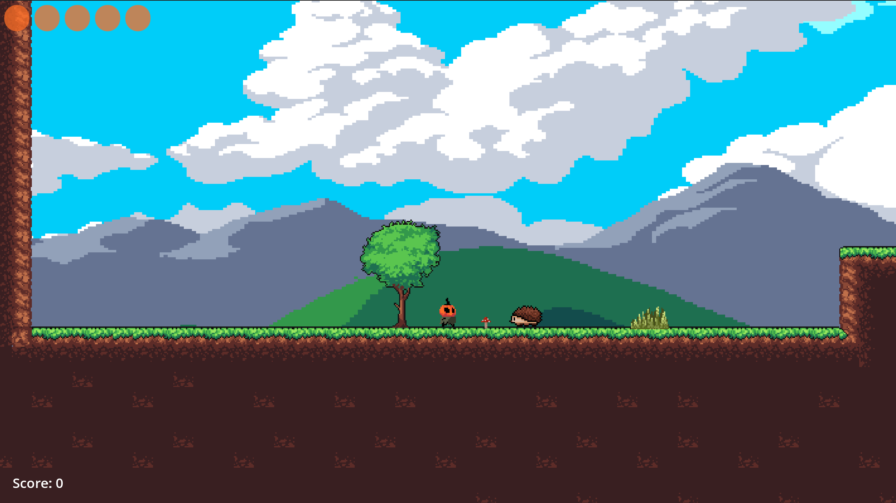
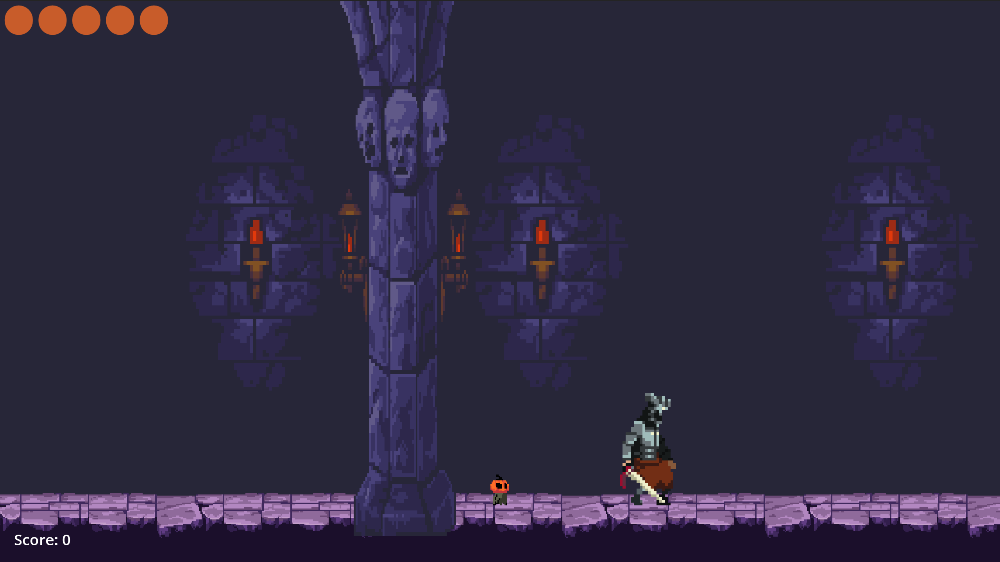
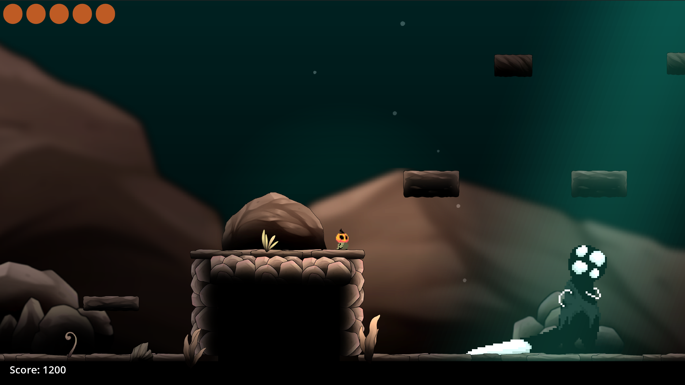

# Asset Flip

A two-dimensional side-scrolling platformer with melee combat, built in Godot 4
as a senior capstone project at Appalachian State University.

## Play

- **In your browser:** [play on itch.io](https://rayar93.itch.io/asset-flip)
- **Download:** Windows and Linux builds are on the [Releases page](../../releases).

Move with A and D or the arrow keys, jump and double jump with Space, attack
with J while holding W or S to aim up or down, dash with K, and pause with Esc.
A downward attack pogoes the player off enemies.

## How it works

Asset Flip uses two layers: persistent global services (Godot autoloads) and a
single active scene tree. Autoloads persist across scene changes; the scene tree
is rebuilt each transition. This separation defines the overall architecture.

Seven autoloads handle global concerns:

| Autoload | Responsibility |
| --- | --- |
| `GameFlow` | Scene transitions, fade overlay, win and death routing |
| `AudioManager` | Sound pools and music/ambient players |
| `VFX` | Screen shake via a trauma model, resolving the camera per scene |
| `HealthUI` | CanvasLayer that reconnects to the current player |
| `PauseMenu` | Toggles pause and continues processing while paused |
| `ScoreManager` | Tracks score and emits updates |
| `UISound` | Auto-connects button hover and click sounds |

The scene tree contains only level-specific content: geometry, enemies, the
player, transitions. Because global systems already exist, levels require
minimal setup.

**State machines.** All actors use explicit finite state machines implemented
uniformly: an enum, a state variable, and a per-frame match, with transitions
going through a `set_state` method. The player has six states - GROUNDED, AIR,
ATTACK, HURT, DASH and DEAD - with movement, input locking and transitions
defined per state, so that DASH overrides gravity and DEAD routes through
GameFlow. Standard enemies use IDLE, CHASE, ATTACK, HURT and DEAD, while
patrol-only types reduce this to PATROL, HURT and DEAD. The bosses are more
complex: the knight has 11 states covering multiple attacks, a leap and plunge,
an evasive roll and randomized attack selection, and the witch has 10 states
driven by position-based tuning variables for far, medium, overhead and strong
behavior.

A shared base class, `BaseEnemy`, centralizes hurt handling, knockback, edge
detection, contact damage and death logic. Subclasses override hooks such as
`_enemy_ready` and `_enemy_physics_process`.

**Signal-driven combat.** Hit detection uses separate hitbox and hurtbox Area2D
nodes. When overlap occurs, the hurtbox emits a signal carrying the attacker's
position. This decouples attacker and receiver, allows frame-accurate hitbox
activation, and supports multiple attack types without special-case logic. The
attacker never knows what it hit, and the recipient never knows what hit it.

**Level flow.** The game runs Tutorial, then Levels 1 through 3, with a secret
fourth level reachable through a hidden drop in Level 1 and ending in the witch
fight. All transitions go through `GameFlow.go_to_scene`: fade out, change
scene, reposition the player, update audio, fade in. A `last_level_path`
variable ensures the continue button on a death screen returns to the correct
level.

## Run from source

Requires Godot 4.6. Clone the repository, open `project.godot` in the editor,
and press F5.

## Credits

Built by Alan Ray and Patrick Anderson over eleven one-week sprints in spring
2026. Every third-party art and audio pack, with its creator and source, is
listed in [CREDITS.md](CREDITS.md).

## Report and presentation

- **Report:** [reports/report.pdf](reports/report.pdf) - the 21-page technical report covering design, development, testing, results and future work
- **Presentation:** [reports/presentation.pdf](reports/presentation.pdf) - the final capstone presentation
